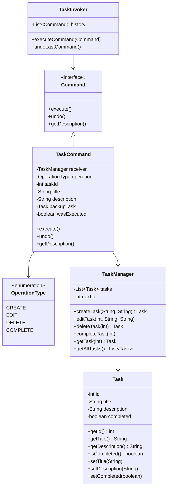

# 📝 Sistema de Gestión de Tareas

## 📋 Descripción

Sistema de gestión de tareas que permite a los usuarios crear, editar, eliminar y completar tareas. Cada acción realizada por el usuario corresponde a una operación que debe ser ejecutada, manteniendo un registro de todas las acciones para permitir la reversión de las mismas.

## 📌 Funcionalidades del Sistema

Los usuarios pueden realizar las siguientes operaciones sobre las tareas:
- **Crear** nuevas tareas con título y descripción
- **Editar** tareas existentes (título y descripción)
- **Eliminar** tareas del sistema
- **Completar** tareas marcándolas como finalizadas
- **Deshacer** la última acción realizada

## 🎯 Requisitos de la Solución

La solución propuesta debe permitir:
- Desacoplar el invocador de los objetos que realizan las acciones
- Permitir la extensión de nuevas operaciones sin modificar el código existente
- Facilitar el registro de acciones para realizar operaciones de reversión

### Criterios de Calidad

- El código debe seguir el principio de responsabilidad única
- Debe ser extensible para agregar nuevos tipos de comandos
- Debe mantener un historial de comandos para operaciones de deshacer
- Las operaciones deben ser reversibles

## 🧩 Patrón Implementado

Se implementó el patrón **Command** (patrón de comportamiento) para encapsular cada acción que el usuario puede realizar sobre una tarea.

### Estructura del Código (Versión Simplificada)



### Beneficios del Patrón Command

1. **Desacoplamiento**: El invocador (TaskInvoker) no necesita conocer los detalles de cómo se ejecutan las operaciones
2. **Extensibilidad**: Se pueden agregar nuevos comandos sin modificar el código existente
3. **Reversibilidad**: Cada comando puede deshacerse, permitiendo operaciones de undo
4. **Registro de acciones**: Se mantiene un historial de comandos ejecutados

## 🚀 Uso del Sistema (Versión Simplificada)

```java
// Crear el gestor de tareas y el invocador
TaskManager taskManager = new TaskManager();
TaskInvoker invoker = new TaskInvoker();

// Crear una nueva tarea
Command createCommand = new TaskCommand(taskManager, TaskCommand.OperationType.CREATE, 
    "Estudiar patrones", "Revisar patrón Command");
invoker.executeCommand(createCommand);

// Editar la tarea
Command editCommand = new TaskCommand(taskManager, TaskCommand.OperationType.EDIT, 1,
    "Estudiar patrones de diseño", "Revisar patrón Command en detalle");
invoker.executeCommand(editCommand);

// Completar la tarea
Command completeCommand = new TaskCommand(taskManager, TaskCommand.OperationType.COMPLETE, 1);
invoker.executeCommand(completeCommand);

// Eliminar la tarea
Command deleteCommand = new TaskCommand(taskManager, TaskCommand.OperationType.DELETE, 1);
invoker.executeCommand(deleteCommand);

// Deshacer la última acción
invoker.undoLastCommand();
```
